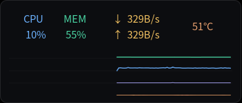
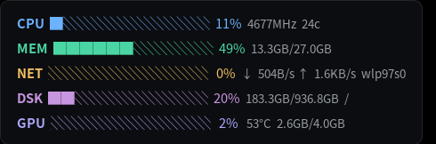
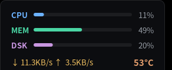
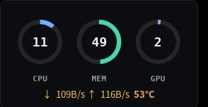
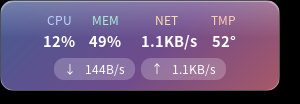
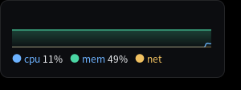
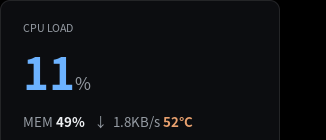
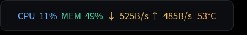
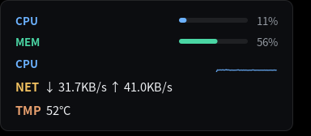

<p align="center">
  
</p>

<h1 align="center">LinuxMonitor</h1>

<p align="center">
  Linux 桌面硬件性能监控悬浮窗 — 类 Windows TrafficMonitor 体验。<br>
  轻量 · 始终置顶 · 可换肤 · 可自定义皮肤 · 系统托盘 · 可插件
</p>

<p align="center">
  
</p>

## 特性

- 🖥 **悬浮窗** — 无边框、始终置顶、可拖拽吸边、圆角透明卡片
- 📊 **实时监控** — CPU / 内存 / 网络 / 磁盘 / GPU / 温度
- 🎨 **8 种内置皮肤** — 统一扁平设计，配色集中管理（见下方一览）
- 🧩 **自定义皮肤** — 写一个 TOML 文件即可造自己的皮肤，无需编译
- 🖼 **系统托盘** — 图标常驻右上角状态区，**不占任务栏**
- 🚀 **开机自启 + 默认后台** — 一键登录自启；启动即脱离终端后台运行
- 📈 **历史记录** — SQLite 存储 + Cairo 折线图 + CSV 导出
- 🌐 **中英双语** — 跟随系统 `LANG` 自动切换
- 🔌 **插件系统** — Rhai 脚本沙箱，可自定义告警
- 🪶 **超轻量** — 约 2MB 内存，4MB 二进制

## 皮肤一览

右键窗口 → **皮肤** 切换。统一扁平视觉，配色集中在 `src/ui/theme.rs`（改一处，全局生效）。

<table>
  <tr>
    <td align="center" width="50%"><br><b>横条模式</b><br><sub>双行标签 + Cairo 折线图（默认）</sub></td>
    <td align="center" width="50%"><br><b>竖排列表</b><br><sub>各指标进度条 + 明细，信息最全</sub></td>
  </tr>
  <tr>
    <td align="center"><br><b>精致扁平</b><br><sub>圆角细进度条 + 右对齐数值</sub></td>
    <td align="center"><br><b>环形仪表</b><br><sub>CPU / MEM / GPU 环形表，数字在环心</sub></td>
  </tr>
  <tr>
    <td align="center"><br><b>毛玻璃</b><br><sub>半透明渐变卡 + 顶部高光</sub></td>
    <td align="center"><br><b>极光</b><br><sub>指标渲染为渐变色场</sub></td>
  </tr>
  <tr>
    <td align="center"><br><b>大字极简</b><br><sub>主指标超大显示，其余低调</sub></td>
    <td align="center"><br><b>紧凑模式</b><br><sub>单行，最不占地方</sub></td>
  </tr>
</table>

> **毛玻璃说明**：GTK3 / X11 无法获取窗口背景像素，因此**没有真正的背景模糊 / 折射**，此皮肤用「半透明 + 渐变 + 高光」模拟玻璃质感。真模糊需合成器级支持（如 KWin 模糊、picom blur）。

## 安装

```bash
# 编译
cargo build --release

# 安装
sudo cp target/release/linux-monitor /usr/local/bin/

# 运行
linux-monitor
```

启动后默认转入后台（脱离终端）；调试时加 `--foreground` 让它留在前台、日志输出到 stderr。

### 打包为 .deb（Debian/Ubuntu）

```bash
cargo install cargo-deb          # 一次性
cargo deb                        # 产物: target/debian/linux-monitor_<版本>_amd64.deb
sudo apt install ./target/debian/linux-monitor_*_amd64.deb
```

`.deb` 会把二进制装到 `/usr/bin`、`.desktop` 装到应用菜单、图标装到 hicolor 主题，并自动声明运行时依赖（GTK3 / Cairo / Pango / libayatana-appindicator3）。

## 快捷键

| 快捷键 | 功能 |
|--------|------|
| Ctrl+Shift+T | 显示 / 隐藏 |
| Ctrl+Shift+S | 设置 |
| Ctrl+Shift+H | 历史 |
| Ctrl+Q | 退出 |
| 右键 / 托盘图标 | 菜单（切皮肤 / 设置 / 历史 / 退出） |
| 左键拖拽 | 移动窗口（靠边自动吸附） |

## 自定义皮肤

把 `*.toml` 皮肤文件放进 `~/.config/linux-monitor/skins/`，右键 **皮肤** 菜单即可选择（首次运行会自动生成一份带注释的 `example.toml` 模板）。纯文本、可热重载、方便分享——加 / 改文件后重新打开右键菜单即刷新。

<table>
  <tr>
    <td width="46%"></td>
    <td width="54%">

```toml
name = "我的皮肤"       # 菜单显示名
layout = "vertical"     # vertical | horizontal

[[row]]
metric = "cpu"          # cpu|mem|net|disk|gpu|temp
element = "bar"         # bar|text|sparkline|ring

[[row]]
metric = "cpu"
element = "sparkline"
color = "#6cb2ff"

[[row]]
metric = "net"
element = "text"

[[row]]
metric = "temp"
element = "text"
color = "auto"          # 温度自动分级
```

</td>
  </tr>
</table>

字段一览：

| 字段 | 取值 | 说明 |
|------|------|------|
| `name` | 任意字符串 | 皮肤菜单显示名 |
| `layout` | `vertical` / `horizontal` | 整体排列方向 |
| `[[row]].metric` | `cpu` `mem` `net` `disk` `gpu` `temp` | 该行监控的指标 |
| `[[row]].element` | `bar` `text` `sparkline` `ring` | 该行的呈现形式 |
| `[[row]].color` | `#rrggbb` / `auto` / 省略 | 颜色，`auto` 用内置配色（温度自动分级） |
| `[[row]].label` | 任意字符串（可选） | 标签文字，默认用指标名 |

## 插件

插件是放在 `~/.config/linux-monitor/plugins/*.rhai` 的 [Rhai](https://rhai.rs/) 脚本，在**沙箱**中运行（无文件系统 / 网络 / 外部命令访问），每 60 秒执行一次，可用于自定义告警。

可用变量：`cpu_percent` `mem_percent` `net_rx` `net_tx` `cpu_temp` `gpu_temp` `core_count`；可调用 `ALERT.call(类型, 阈值, 当前值, 消息)`。

```rhai
// 温度告警示例
if gpu_temp > 80.0 {
    ALERT.call("GPU温度告警", 80.0, gpu_temp, "GPU 温度过高");
}
```

## 配置

配置文件位于 `~/.config/linux-monitor/config.toml`（权限 0600），涵盖轮询间隔、外观（皮肤 / 字号 / 透明度 / 置顶 / 背景）、各监控项开关、窗口位置等。设置窗口（Ctrl+Shift+S）中的改动会写回此文件。**开机启动** 开关在 设置 → 常规。

## 技术栈

Rust + GTK3 + Cairo + SQLite + Rhai + libayatana-appindicator

## 开源引用 / 致谢

主要依赖：GTK 3 / Cairo / Pango / GdkPixbuf（LGPL-2.1+）、libayatana-appindicator3（LGPL）、SQLite（Public Domain），以及 `rhai` / `sysinfo` / `rusqlite` / `serde` 等 Rust crate（MIT 或 Apache-2.0）。完整清单与许可证见 [CREDITS.md](CREDITS.md)。

应用图标（Pulse）为本项目原创，Cairo 绘制。

## 开源协议

本项目以 **GPL-3.0-or-later** 授权，完整条款见 [LICENSE](LICENSE)。
